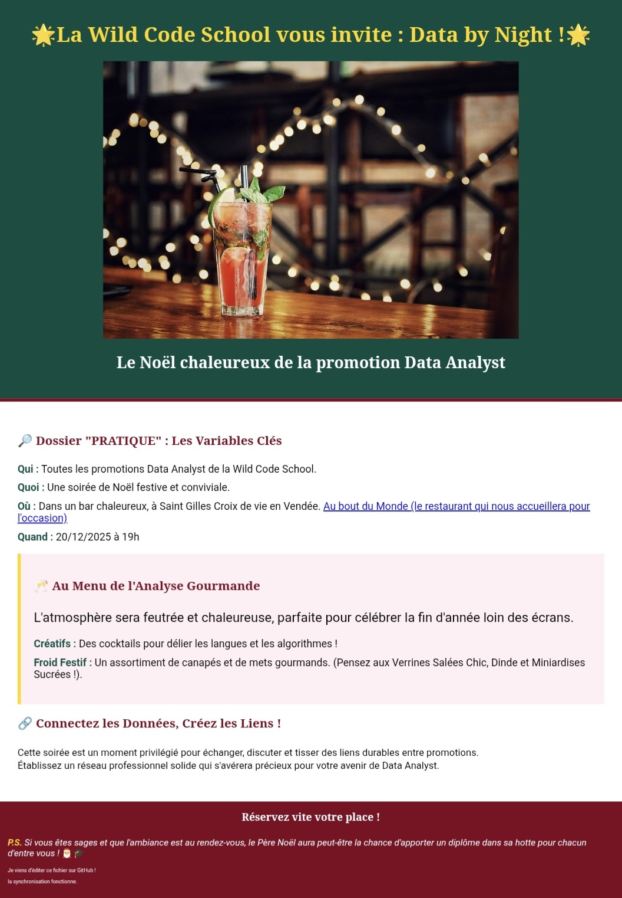

creation of an HTML page and a CSS page

# 🌟 Projet : Ma première page Web - "Data by Night"

## 🎯 Objectif du Projet
Ce projet a été réalisé dans le cadre de ma formation à la **Wild Code School**. L'énoncé demandait de créer une page web élégante et personnalisée en utilisant les bases du langage **HTML5** et du **CSS3**, puis de l'héberger pour la rendre accessible en ligne.

J'ai choisi de créer une **Landing Page d'invitation** pour une soirée de Noël dédiée à la promotion Data Analyst.

---

## 🛠️ Compétences travaillées
* **HTML :** Structuration du contenu (titres, listes, paragraphes).
* **CSS :** Personnalisation du design (couleurs, polices, bordures, mise en page).
* **Multimédia :** Intégration d'images (`img`) et de liens hypertextes (`a`).
* **Hébergement :** Mise en ligne via **GitHub Pages** pour un accès public.

---

## ✨ Détails de la réalisation
* **Thème :** "Data by Night" - Une ambiance festive et conviviale.
* **Interactivité :** Liens vers le lieu de l'événement et mise en avant des informations clés (Qui, Quoi, Où, Quand).
* **Design :** Utilisation d'un code couleur spécifique (Vert sapin, Or et Bordeaux) pour une identité visuelle forte.

---

## 🌍 Accès au site
Le projet est hébergé en direct sur GitHub Pages. Vous pouvez le consulter ici :
👉 **[VOIR MA PAGE EN LIGNE](https://caroleponsbachmann-bit.github.io/)**

---

## 👤 Auteur
**Carole Pons-Bachmann**

---
*Projet réalisé en autonomie pour valider les bases de l'intégration web.*

